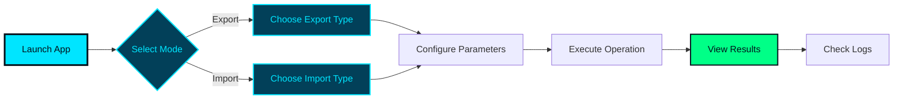

<div align="center">

```
╔════════════════════════════════════════════════════════════════════════╗
║                                                                        ║
║    ████████╗██████╗  █████╗ ██████╗ ███████╗                           ║ 
║    ╚══██╔══╝██╔══██╗██╔══██╗██╔══██╗██╔════╝                           ║
║       ██║   ██████╔╝███████║██║  ██║█████╗                             ║
║       ██║   ██╔══██╗██╔══██║██║  ██║██╔══╝                             ║
║       ██║   ██║  ██║██║  ██║██████╔╝███████╗                           ║
║       ╚═╝   ╚═╝  ╚═╝╚═╝  ╚═╝╚═════╝ ╚══════╝                           ║
║                                                                        ║
║              ██████╗  █████╗ ████████╗ █████╗                          ║
║              ██╔══██╗██╔══██╗╚══██╔══╝██╔══██╗                         ║
║              ██║  ██║███████║   ██║   ███████║                         ║
║              ██║  ██║██╔══██║   ██║   ██╔══██║                         ║
║              ██████╔╝██║  ██║   ██║   ██║  ██║                         ║
║              ╚═════╝ ╚═╝  ╚═╝   ╚═╝   ╚═╝  ╚═╝                         ║
║                                                                        ║
║         ███████╗████████╗██╗   ██╗██████╗ ██╗ ██████╗                  ║
║         ██╔════╝╚══██╔══╝██║   ██║██╔══██╗██║██╔═══██╗                 ║
║         ███████╗   ██║   ██║   ██║██║  ██║██║██║   ██║                 ║
║         ╚════██║   ██║   ██║   ██║██║  ██║██║██║   ██║                 ║
║         ███████║   ██║   ╚██████╔╝██████╔╝██║╚██████╔╝                 ║
║         ╚══════╝   ╚═╝    ╚═════╝ ╚═════╝ ╚═╝ ╚═════╝                  ║
║                                                                        ║
╚════════════════════════════════════════════════════════════════════════╝
```

<h1>
  
</h1>

<p align="center">
  
  
  
  
</p>

<p align="center">
  
  
  
</p>

---

### 🚀 A Modern Desktop Solution for Trade Data Management

**TradeData Studio** is a powerful, intuitive desktop application designed for seamless SQL Server data operations. Built with cutting-edge technologies, it combines elegant design with robust functionality to streamline your database workflows.

</div>

---

## 📑 Table of Contents

<div style="background: linear-gradient(135deg, #02111B 0%, #024059 100%); padding: 20px; border-radius: 10px; border-left: 4px solid #00E5FF;">

- [✨ Features](#-features)
- [🎯 Key Highlights](#-key-highlights)
- [💾 Installation](#-installation)
- [🔧 Configuration](#-configuration)
- [🎮 Usage](#-usage)
- [⌨️ Keyboard Shortcuts](#️-keyboard-shortcuts)
- [📊 Export Formats](#-export-formats)
- [🏗️ Architecture](#️-architecture)
- [📚 Documentation](#-documentation)
- [🔍 Troubleshooting](#-troubleshooting)
- [🛣️ Roadmap](#️-roadmap)
- [🤝 Contributing](#-contributing)
- [📄 License](#-license)

</div>

---

## ✨ Features

<table>
<tr>
<td width="50%">

### 🎨 **Modern UI/UX**
- Clean, intuitive interface built with **AvaloniaUI**
- Responsive design with **theme colors**
- Real-time progress indicators
- Activity logging panel

</td>
<td width="50%">

### ⚡ **High Performance**
- Streaming data export for **large datasets**
- Memory-efficient processing
- Asynchronous operations
- Configurable batch sizes

</td>
</tr>
<tr>
<td width="50%">

### 🔄 **Dual Operation Modes**
- **Export Mode**: Extract data to multiple formats
- **Import Mode**: Load data from various sources
- Easy mode switching
- Context-specific operations

</td>
<td width="50%">

### 📦 **Multi-Format Export**
- **Excel** (.xlsx) - Rich formatting support
- **CSV** - Universal compatibility
- **TXT** - Plain text export
- Custom delimiter support

</td>
</tr>
<tr>
<td width="50%">

### 🗄️ **Database Integration**
- SQL Server native support
- Windows & SQL Authentication
- Stored procedure execution
- Parameter validation

</td>
<td width="50%">

### 📝 **Comprehensive Logging**
- Real-time activity tracking
- Execution time monitoring
- Error diagnostics
- Log file rotation

</td>
</tr>
</table>

---

## 🎯 Key Highlights

<div align="center">

```
┌──────────────────────────────────────────────────────────────────┐
│                                                                  │
│  🎨 Beautiful Design    │  ⚡ Lightning Fast  │  🔒 Secure      │
│  Modern AvaloniaUI      │  Async Operations  │  Safe Auth         │
│                         │                    │                    │
│  📊 Smart Export        │  🔍 Easy Config    │ 🛠️ Extensible    │
│  Multiple Formats       │  JSON Settings     │  Plugin Ready     │
│                                                                  │
└──────────────────────────────────────────────────────────────────┘
```

</div>

---

## 💾 Installation

### 📋 System Requirements

<div style="background: #02111B; padding: 15px; border-radius: 8px; border: 1px solid #00E5FF;">

| Component | Minimum | Recommended |
|-----------|---------|-------------|
| **OS** | Windows 10 (1903+) | Windows 11 |
| **RAM** | 4 GB | 8 GB |
| **Disk Space** | 500 MB | 1 GB |
| **SQL Server** | 2017+ | 2019+ |

</div>

### 📥 Installation Options

<details open>
<summary><b>🌟 Option 1: Self-Contained Build (Recommended)</b></summary>

```powershell
# 1. Download the appropriate build
#    - Windows-x64.zip (64-bit systems) ~150 MB
#    - Windows-x86.zip (32-bit systems) ~140 MB

# 2. Extract to your desired location
Expand-Archive -Path "Windows-x64.zip" -DestinationPath "C:\Program Files\TradeDataStudio"

# 3. Navigate to the installation directory
cd "C:\Program Files\TradeDataStudio"

# 4. Run the application
.\TradeDataStudio.Desktop.exe
```

✅ **No additional runtime required** - Everything is included!

</details>

<details>
<summary><b>⚙️ Option 2: Portable Build</b></summary>

```powershell
# 1. Install .NET 8.0 Runtime (if not already installed)
winget install Microsoft.DotNet.Runtime.8

# 2. Download Portable.zip (~50 MB)

# 3. Extract to any location
Expand-Archive -Path "Portable.zip" -DestinationPath "D:\Apps\TradeDataStudio"

# 4. Run the application
.\TradeDataStudio.Desktop.exe
```

💡 **Smaller footprint** - Perfect for USB drives or limited storage

</details>

### 📂 Directory Structure

```
TradeDataStudio/
│
├── 📁 config/                    # Configuration files
│   ├── appsettings.json         # Application settings
│   ├── database.json            # Database connection
│   ├── export_tables.json       # Export table definitions
│   ├── export_procedures.json   # Export stored procedures
│   ├── import_tables.json       # Import table definitions
│   └── import_procedures.json   # Import stored procedures
│
├── 📁 exports/                   # Exported data files
│   └── (Generated Excel, CSV, TXT files)
│
├── 📁 imports/                   # Import data files
│   └── (Source files for import)
│
├── 📁 logs/                      # Application logs
│   ├── application.log          # General activity
│   ├── error.log                # Error details
│   └── debug.log                # Debug information
│
└── 📄 TradeDataStudio.Desktop.exe  # Main executable
```

---

## 🔧 Configuration

### 🎛️ Quick Setup

<div style="background: linear-gradient(to right, #02111B, #024059); padding: 20px; border-radius: 10px;">

#### **1️⃣ Database Connection** (`database.json`)

```json
{
  "server": "YOUR_SERVER\\INSTANCE",
  "database": "YOUR_DATABASE",
  "username": "",
  "password": "",
  "useWindowsAuthentication": true,
  "connectionTimeout": 30,
  "trustServerCertificate": true
}
```

#### **2️⃣ Application Settings** (`appsettings.json`)

```json
{
  "application": {
    "name": "TradeData Studio",
    "version": "1.0.0",
    "defaultMode": "Export",
    "logLevel": "Information",
    "exportFormats": ["Excel", "CSV", "TXT"]
  },
  "performance": {
    "batchSize": 50000,
    "excelMaxRowsPerSheet": 1048576,
    "enableAsyncExport": true,
    "memoryThresholdMB": 512
  }
}
```

</div>

For detailed configuration options, see **[CONFIGURATION.md](./docs/CONFIGURATION.md)**

---

## 🎮 Usage

### 🚀 Getting Started

<div align="center">



</div>

### 📤 Export Workflow

1. **Launch the Application**
   - Double-click `TradeDataStudio.Desktop.exe`
   - Application starts in Export mode by default

2. **Select Export Type**
   - **Table Export**: Direct table data export
   - **Stored Procedure**: Execute procedures with parameters

3. **Configure Parameters**
   ```
   Example: Date Range Export
   ├── Start Date: 20241101 (YYYYMMDD)
   └── End Date: 20241130 (YYYYMMDD)
   ```

4. **Choose Output Format**
   - Excel (`.xlsx`) - Best for analysis
   - CSV (`.csv`) - Universal compatibility
   - TXT (`.txt`) - Plain text format

5. **Execute & Monitor**
   - Click "Export" or press `Ctrl+E`
   - Watch real-time progress
   - Check activity log for details

6. **Access Your Data**
   - Files saved to `exports/` folder
   - Timestamped filenames
   - Auto-organized by date

---

## ⌨️ Keyboard Shortcuts

<div style="background: #02111B; padding: 20px; border-radius: 10px; border-left: 5px solid #00E5FF;">

| Shortcut | Action | Description |
|:--------:|--------|-------------|
| <kbd>Ctrl</kbd> + <kbd>E</kbd> | **Export to Excel** | Quick Excel export |
| <kbd>Ctrl</kbd> + <kbd>X</kbd> | **Export to CSV** | Quick CSV export |
| <kbd>Ctrl</kbd> + <kbd>S</kbd> | **Execute Procedure** | Run stored procedure |
| <kbd>Ctrl</kbd> + <kbd>T</kbd> | **Test Connection** | Verify database connectivity |
| <kbd>Ctrl</kbd> + <kbd>L</kbd> | **View Logs** | Open log viewer |
| <kbd>Ctrl</kbd> + <kbd>O</kbd> | **Open Settings** | Access configuration |
| <kbd>F5</kbd> | **Refresh** | Reload current view |
| <kbd>Esc</kbd> | **Cancel** | Abort current operation |

</div>

---

## 📊 Export Formats

<table>
<tr>
<th>Format</th>
<th>Extension</th>
<th>Use Case</th>
<th>Max Rows</th>
</tr>
<tr>
<td><b>📗 Excel</b></td>
<td><code>.xlsx</code></td>
<td>Data analysis, formatting, charts</td>
<td>1,048,576</td>
</tr>
<tr>
<td><b>📄 CSV</b></td>
<td><code>.csv</code></td>
<td>Universal import, data transfer</td>
<td>Unlimited*</td>
</tr>
<tr>
<td><b>📝 TXT</b></td>
<td><code>.txt</code></td>
<td>Plain text, custom delimiters</td>
<td>Unlimited*</td>
</tr>
</table>

<sup>*Limited only by available disk space</sup>

---

## 🏗️ Architecture

<div align="center">

```
┌─────────────────────────────────────────────────────────────┐
│                     PRESENTATION LAYER                      │
│                                                             │
│  ┌──────────────┐  ┌──────────────┐  ┌──────────────┐       │
│  │   Views      │  │  ViewModels  │  │   Commands   │       │
│  │  (AXAML)     │  │   (MVVM)     │  │  (Handlers)  │       │
│  └──────────────┘  └──────────────┘  └──────────────┘       │
└─────────────────────────────────────────────────────────────┘
                          ▼
┌─────────────────────────────────────────────────────────────┐
│                      BUSINESS LAYER                         │
│                                                             │
│  ┌────────────┐  ┌────────────┐  ┌────────────┐             │
│  │  Export    │  │  Import    │  │  Logging   │             │
│  │  Service   │  │  Service   │  │  Service   │             │
│  └────────────┘  └────────────┘  └────────────┘             │
└─────────────────────────────────────────────────────────────┘
                          ▼
┌─────────────────────────────────────────────────────────────┐
│                       DATA LAYER                            │
│                                                             │
│  ┌────────────┐  ┌────────────┐  ┌────────────┐             │
│  │ Database   │  │    File    │  │   Config   │             │
│  │  Service   │  │   System   │  │  Service   │             │
│  └────────────┘  └────────────┘  └────────────┘             │
└─────────────────────────────────────────────────────────────┘
```

</div>

### 🎨 Technology Stack

<div align="center">

| Layer | Technology | Purpose |
|-------|-----------|---------|
| **UI Framework** | AvaloniaUI 11.0+ | Cross-platform XAML UI |
| **Runtime** | .NET 8.0 | Modern, high-performance runtime |
| **Database** | Microsoft.Data.SqlClient | SQL Server connectivity |
| **Excel Export** | ClosedXML | Excel file generation |
| **Logging** | Serilog | Structured logging |
| **Architecture** | MVVM | Clean separation of concerns |

</div>

---

## 📚 Documentation

<div style="background: linear-gradient(135deg, #024059 0%, #02111B 100%); padding: 15px; border-radius: 8px;">

📖 **Comprehensive Guides Available:**

- **[User Guide](./docs/USER_GUIDE.md)** - Complete usage instructions with examples
- **[Configuration Guide](./docs/CONFIGURATION.md)** - Detailed configuration reference
- **[Troubleshooting](./docs/TROUBLESHOOTING.md)** - Common issues and solutions
- **[Installation Guide](./deployment/INSTALLATION.md)** - Step-by-step installation
- **[Release Notes](./deployment/RELEASE_NOTES.md)** - Version history and features

</div>

---

## 🔍 Troubleshooting

### ⚠️ Common Issues

<details>
<summary><b>🔌 Connection Failed</b></summary>

**Symptoms:** Cannot connect to SQL Server

**Solutions:**
1. Verify SQL Server is running
2. Check `database.json` configuration
3. Test network connectivity
4. Verify authentication credentials
5. Check firewall settings

```powershell
# Test SQL Server connectivity
Test-NetConnection -ComputerName "SERVER\INSTANCE" -Port 1433
```

</details>

<details>
<summary><b>💾 Export Fails</b></summary>

**Symptoms:** Export operation errors

**Solutions:**
1. Check disk space in `exports/` folder
2. Verify write permissions
3. Review stored procedure parameters
4. Check logs in `logs/error.log`
5. Validate data types

</details>

<details>
<summary><b>🚀 Slow Performance</b></summary>

**Symptoms:** Slow export operations

**Solutions:**
1. Adjust `batchSize` in `appsettings.json`
2. Increase `memoryThresholdMB`
3. Optimize database queries
4. Check network bandwidth
5. Review SQL Server performance

</details>

For more solutions, see **[TROUBLESHOOTING.md](./docs/TROUBLESHOOTING.md)**

---

## 🛣️ Roadmap

<div align="center">

### 🎯 Planned Features

```
┌─────────────┬─────────────┬─────────────┬─────────────┐
│  Version    │   Focus     │   Status    │    ETA      │
├─────────────┼─────────────┼─────────────┼─────────────┤
│  v1.1.0     │  Security   │  Planned    │  Q1 2026    │
│             │  Updates    │             │             │
├─────────────┼─────────────┼─────────────┼─────────────┤
│  v1.2.0     │  Multi-DB   │  Planned    │  Q2 2026    │
│             │  Support    │             │             │
├─────────────┼─────────────┼─────────────┼─────────────┤
│  v1.3.0     │  Scheduled  │  Research   │  Q3 2026    │
│             │  Exports    │             │             │
├─────────────┼─────────────┼─────────────┼─────────────┤
│  v2.0.0     │  Cloud      │  Concept    │  Q4 2026    │
│             │  Integration│             │             │
└─────────────┴─────────────┴─────────────┴─────────────┘
```

</div>

#### v1.1.0 - Security & Performance
- 🔒 Package security updates
- ⚡ Enhanced data validation
- 🎨 Dark theme support
- 📊 Performance monitoring

#### v1.2.0 - Advanced Features
- 🗄️ Multi-database connections
- 📅 Scheduled exports
- 📈 Report generation
- 🔍 Advanced filtering

#### v1.3.0 - Automation
- ⏰ Automated workflows
- 📧 Email notifications
- 🔄 Data synchronization
- 🎯 Custom templates

---

## 🤝 Contributing

We welcome contributions! Here's how you can help:

<div style="background: #024059; padding: 15px; border-radius: 8px; border-left: 4px solid #00E5FF;">

### 🌟 Ways to Contribute

- 🐛 **Report Bugs** - Found an issue? Let us know!
- 💡 **Suggest Features** - Have ideas? We're listening!
- 📝 **Improve Documentation** - Help others understand better
- 🔧 **Submit Pull Requests** - Code contributions welcome
- ⭐ **Star the Project** - Show your support!

### 📋 Contribution Guidelines

1. Fork the repository
2. Create a feature branch (`git checkout -b feature/AmazingFeature`)
3. Commit your changes (`git commit -m 'Add some AmazingFeature'`)
4. Push to the branch (`git push origin feature/AmazingFeature`)
5. Open a Pull Request

</div>

---

## 📄 License

<div align="center">

This project is licensed under the **MIT License**.

```
MIT License

Copyright (c) 2024-2025 TradeData Studio

Permission is hereby granted, free of charge, to any person obtaining a copy
of this software and associated documentation files (the "Software"), to deal
in the Software without restriction, including without limitation the rights
to use, copy, modify, merge, publish, distribute, sublicense, and/or sell
copies of the Software, and to permit persons to whom the Software is
furnished to do so, subject to the following conditions:

The above copyright notice and this permission notice shall be included in all
copies or substantial portions of the Software.
```

[View Full License](./LICENSE)

</div>

---

## 💬 Support

<div align="center">

### Need Help?

<table>
<tr>
<td align="center">
  <h3>📧 Email</h3>
  <p>support@tradedatastudio.com</p>
</td>
<td align="center">
  <h3>📖 Documentation</h3>
  <p><a href="./docs/">Read the Docs</a></p>
</td>
<td align="center">
  <h3>🐛 Issues</h3>
  <p><a href="https://github.com/yhassan-git-real/TradeDataStudio/issues">Report Bug</a></p>
</td>
</tr>
</table>

### 📊 Project Stats


---

<p>
  Made with ❤️ by the TradeData Studio Team
</p>

<p>
  
  
  
</p>

```
┌──────────────────────────────────────────────────────────────┐
│                                                              │
│  "Simplifying Database Operations, One Export at a Time"     │
│                                                              │
└──────────────────────────────────────────────────────────────┘
```

⭐ **Star us on GitHub** — it motivates us to keep improving!

</div>
